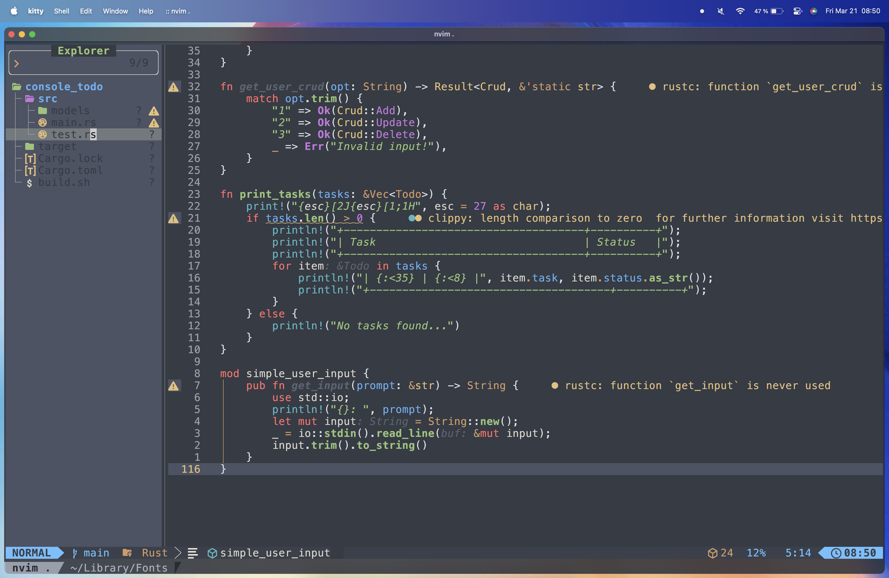
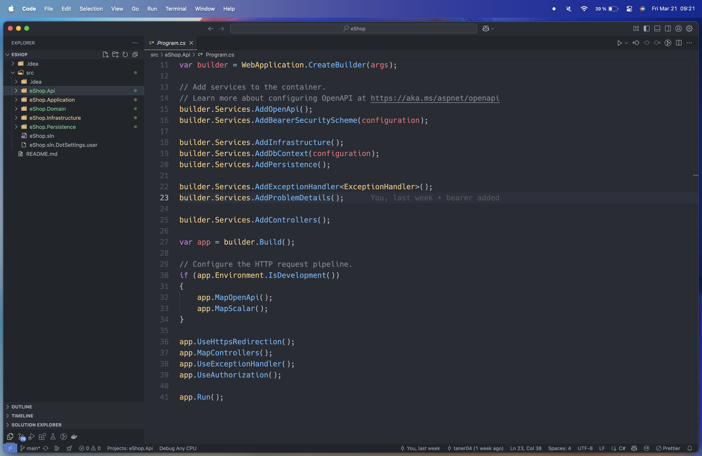

# Dotfiles

This repository contains my personal configuration files (dotfiles) for my macOS setup. My windows setup is the same.

### Fonts

I use [Nerdfonts](https://www.nerdfonts.com/) for my terminal and neovim.

- Current fonts:
  - Hack Nerd Font Regular
  - JetBrains Mono Nerd Font Regular
  - Iosevka Nerd Font Regular
  - MesloLGS NF Regular

### Starship 

My configurations are in the `Starship` folder. I got the [configs](https://github.com/starship/starship/discussions/1107) from here.

### Terminal

I use [Kitty](https://sw.kovidgoyal.net/kitty/) with zsh and starship prompt. Theme: [cockpit](Starship/cockpit.toml).

##### zsh plugins:
- [zsh\-autosuggestions](https://github.com/zsh\-users/zsh\-autosuggestions)
- [zsh\-syntax\-highlighting](https://github.com/zsh\-users/zsh\-syntax\-highlighting)
- [you\-should\-use](https://github.com/MichaelAquilina/zsh\-you\-should\-use)
- [zsh\-bat](https://github.com/jeffreytse/zsh\-bat)

#### Neovim

It's just a simple config with  [LazyVim](https://github.com/LazyVim/LazyVim) and [OneDarkPro](https://github.com/nxstynate/oneDarkPro.nvim) as theme.

#### VSCode

For my theme I use the [One Dark Pro](https://marketplace.visualstudio.com/items?itemName=zhuangtongfa.Material-theme) theme with the [Studio Icons](https://marketplace.visualstudio.com/items?itemName=jtlowe.vscode-icon-theme).

